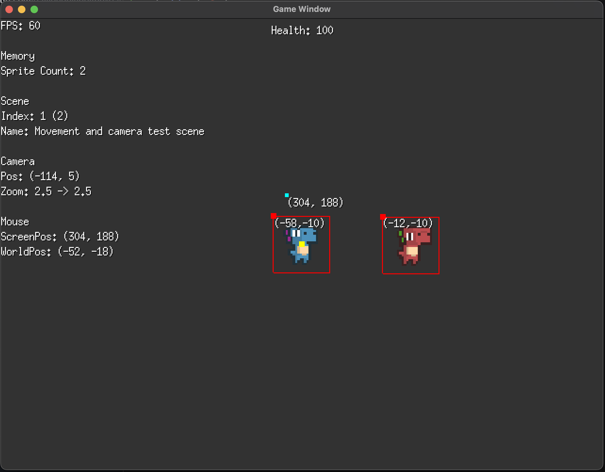

<b>2D Game Framework using Go and
<a href="https://github.com/hajimehoshi/ebiten" target="_blank">Ebitengine</a></b>

 

This is a for-fun project I am working on with the goal of making future 2D game prototyping/development easy and fun.

 

This framework uses a custom scene-stack system focused around isolating each scene's scope and logic. It also contains a custom camera system and sprite/entity management system. It contains a few demo scenes to test various functionality.

 

Preview screenshot:

 
 

<b>To get started</b>

<ul>
<li>Install Go</li>
<li>Download 
<a href="https://github.com/hajimehoshi/ebiten" target="_blank">Ebitengine</a></b>
</li>
<li>Clone this repository</li>
<li>At the root directory run <b>$ go run .</b>
</ul>

 

<i>I did not create all of the sprites included in this repository. I downloaded them from itch.io and other open-game-asset websites. Credit to their respective creators.</i>
